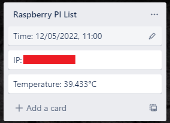

# Auto Note Keeper

## What is this?

This is a small application that automatically logs data to a [Trello](https://trello.com/) list using a cronjob. This uses the the [Trello Rest API](https://developer.atlassian.com/cloud/trello/rest/) to update cards in a list.

## Setup

1. Create `.env` file with following contents:
```env
KEY=<Trello Key>
TOKEN=<Trello Token>
CARDS=<List of Trello card IDs separated by commas>
```

2. Modify [main.py](main.py) to your liking. This example retrieves the date, public IP address and CPU temperatue of a Raspberry Pi 4: 



3. Modify the cronjob in [setup.sh](setup.sh) to the interval you want. Default is 5 minutes.

4. Run [setup.sh](setup.sh)

## Notes

- This has only been tested on Ubuntu 20.04 but should work on any Unix system with Python and Bash.
